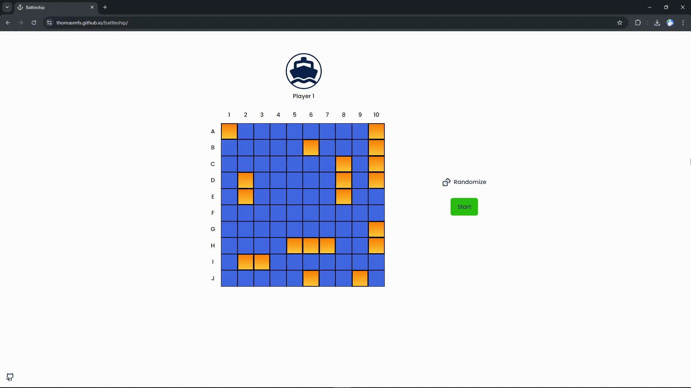

# Battleship

## Overview

This project is a web implementation of the good old battleship game. The user can cycle through possible positions that the ships can be placed in its board, and then start a game against a bot, that ends once either the player's or bot's ships are all sunk. The project was built with a modular strucure and include unit tests to ensure the game's functionality.

## Preview

Live preview: [thomasmfx.github.io/battleship](https://thomasmfx.github.io/battleship/)

## Tools/Technologies

- Javascript
- HTML
- SCSS
- Webpack
- Jest

## Run locally

1. Fork this repository
2. Clone it to your local machine
3. In the project's directory, type `npm install` to install all dependencies
4. Type `npm run start` to open a local server and see the project running in your browser

## Run tests

After making sure you already completed the steps provided in [Run locally](#run-locally), type `npm test` in the project's directory, the test suites must output in your command line

